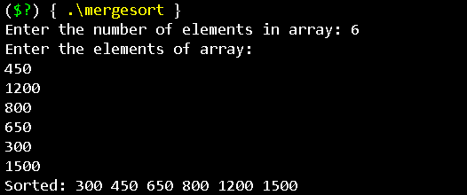
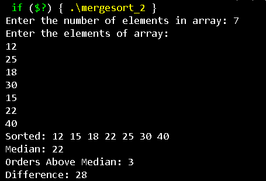
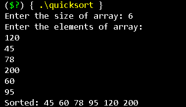
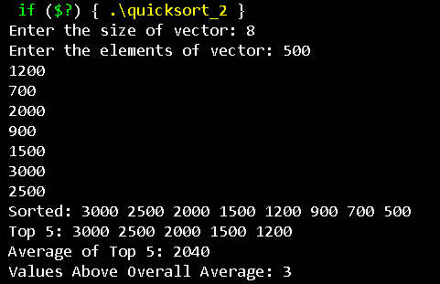
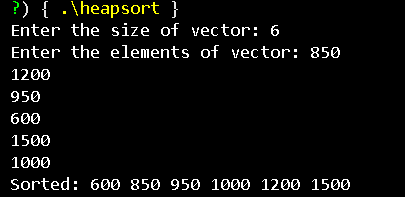
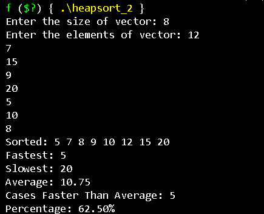

# Week 3 - Sorting Algorithms Assignment

This repository contains the solutions for the Week 3 Data Structures and Algorithms assignment. The assignment focuses on implementing three efficient sorting algorithms:

- Merge Sort
- Quick Sort
- Heap Sort

All programs are implemented in **C++** without using built-in sorting functions.

---

# Algorithms Covered

| Algorithm | Difficulty | Status |
|-----------|------------|--------|
| Merge Sort | Easy | ✅ |
| Merge Sort | Medium | ✅ |
| Quick Sort | Easy | ✅ |
| Quick Sort | Medium | ✅ |
| Heap Sort | Easy | ✅ |
| Heap Sort | Medium | ✅ |

---

# Technologies Used

- C++
- VS Code
- GCC / G++
- Standard Template Library (STL)

---

# Repository Structure

```
.
├── MergeSort_Easy.cpp
├── MergeSort_Medium.cpp
├── QuickSort_Easy.cpp
├── QuickSort_Medium.cpp
├── HeapSort_Easy.cpp
├── HeapSort_Medium.cpp
├── images
│   ├── merge_sort.png
│   ├── mergesort_2.png
│   ├── quicksort.png
│   ├── quicksort_2.png
│   ├── heapsort.png
│   └── heapsort_2.png
└── README.md
```

---

# Merge Sort (Easy)

### Features

- Recursive Merge Sort
- Ascending Order Sorting

### Time Complexity

```
Best Case    : O(n log n)
Average Case : O(n log n)
Worst Case   : O(n log n)
Space        : O(n)
```

### Output

<p align="center">

</p>

---

# Merge Sort (Medium)

### Features

- Merge Sort
- Median Calculation
- Orders Above Median
- Difference between Maximum and Minimum

### Time Complexity

```
Best Case    : O(n log n)
Average Case : O(n log n)
Worst Case   : O(n log n)
Space        : O(n)
```

### Output

<p align="center">

</p>

---

# Quick Sort (Easy)

### Features

- Quick Sort
- Ascending Order Sorting
- In-place Sorting

### Time Complexity

```
Best Case    : O(n log n)
Average Case : O(n log n)
Worst Case   : O(n²)
Space        : O(log n)
```

### Output

<p align="center">

</p>

---

# Quick Sort (Medium)

### Features

- Descending Order Sorting
- Top 5 Highest Values
- Average of Top 5
- Values Above Overall Average

### Time Complexity

```
Best Case    : O(n log n)
Average Case : O(n log n)
Worst Case   : O(n²)
Space        : O(log n)
```

### Output

<p align="center">

</p>

---

# Heap Sort (Easy)

### Features

- Heap Sort
- Ascending Order Sorting
- Max Heap Implementation

### Time Complexity

```
Build Heap   : O(n)
Sorting      : O(n log n)
Overall      : O(n log n)
Space        : O(1)
```

### Output

<p align="center">

</p>

---

# Heap Sort (Medium)

### Features

- Heap Sort
- Fastest Response Time
- Slowest Response Time
- Average Response Time
- Cases Faster Than Average
- Percentage Calculation

### Time Complexity

```
Build Heap   : O(n)
Sorting      : O(n log n)
Overall      : O(n log n)
Space        : O(1)
```

### Output

<p align="center">

</p>

---

# Learning Outcomes

- Divide and Conquer Algorithms
- Merge Sort
- Quick Sort
- Heap Sort
- Heap Construction
- Recursion
- Time Complexity Analysis
- Space Complexity Analysis

---
